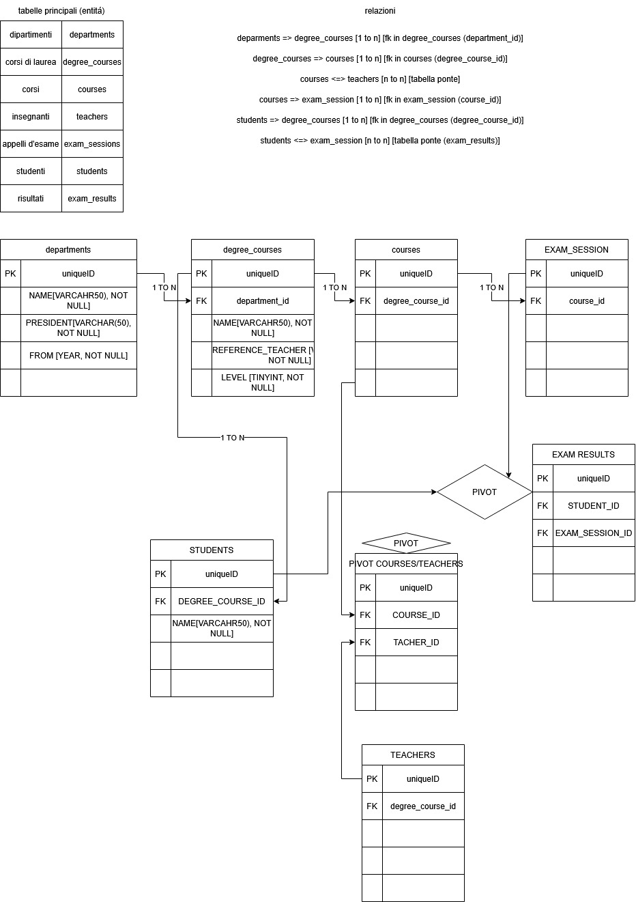

# Dopo aver creato un nuovo database nel vostro MySQL Workbench e aver importato lo schema allegato, eseguite le query del file allegato.

# Cosa consegnare?
Dopo aver testato le vostre query con MySQL Workbench, riportatele in un file txt e caricatelo nella vostra repo.

# GROUP BY

1. Contare quanti iscritti ci sono stati ogni anno
2. Contare gli insegnanti che hanno l'ufficio nello stesso edificio
3. Calcolare la media dei voti di ogni appello d'esame
4. Contare quanti corsi di laurea ci sono per ogni dipartimento

# SELECT

1. Selezionare tutti gli studenti nati nel 1990 (160)

SELECT *
FROM `students`
WHERE `date_of_birth` BETWEEN '1990-01-01' AND '1990-12-31';

2. Selezionare tutti i corsi che valgono più di 10 crediti (479)

SELECT *
FROM `courses`
WHERE `CFU` > 10;

3. Selezionare tutti gli studenti che hanno più di 30 anni

SELECT *
FROM `students`
WHERE `date_of_birth` <= '1996-02-17'

4. Selezionare tutti i corsi del primo semestre del primo anno di un qualsiasi corso di
laurea (286)

SELECT *
FROM `courses`
WHERE `period` = 'I SEMESTRE' AND `year` = 1

5. Selezionare tutti gli appelli d'esame che avvengono nel pomeriggio (dopo le 14) del
20/06/2020 (21)

SELECT *
FROM `exams`
WHERE `date` = '2020-06-20' AND `hour` >= '14:00:00'

6. Selezionare tutti i corsi di laurea magistrale (38)

SELECT *
FROM `degrees`
WHERE `level` = 'magistrale'

7. Da quanti dipartimenti è composta l'università? (12)

SELECT COUNT(id)
FROM `departments` 

8. Quanti sono gli insegnanti che non hanno un numero di telefono? (50)

SELECT COUNT(ID) as 'prof senza numero'
FROM `teachers`
WHERE `PHONE` IS NULL

